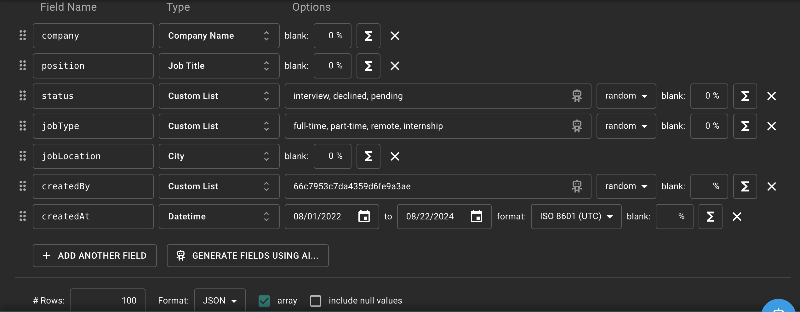

## Packages
`npm install mongoose`
`npm install express`
`npm install express-async-errors`
`npm install dotenv`
`npm install http-status-codes`
`npm install jsonwebtoken`
`npm install bcryptjs`
`npm install helmet`
`npm install xss-clean` // Warn! Not supported!
`npm install moment`
`npm install nodemon -D`

## Engines
Add `"engines": { "node": "20.14.0" }` to package.json to specify the node version when deploying the app!

## .env
MONGO_URI
JWT_SECRET
JWT_LIFETIME

## Run the app
1. Without nodemon: `npm start`
2. With nodemon: `npm run dev`

## Client
- The `client` folder is the complete front end React app built with CRA, this is exactly the same as the Jobster app built in the React course, the only difference is that the `baseURL` in utils/axios.js is our current server!
- The `build` folder contains the optimized and production-ready app built with `npm run build`! This is what we will use as the front end!!!

## Test User
Make sure to create a test user in the MongoDB in advance: 
```js
{
  name: "test user",
  email: "testUser@test.com",
  password: "secret"
}
```
Note that email and password must be exactly the same as above (in order to match client/src/pages/Register.js), so that when we click the Demo App button, we login as test user!

## Populate
- Generate fake data: [Mockaroo](https://www.mockaroo.com/)
- For field that has enum, choose Custom List as type! For createdBy, choose Custom List as type with only one value: the ObjectID of test user! For createdAt (don't forget), choose Datetime as type and ISO 8601 as format!

- Run `node db/populate.js` to populate the mongoDB database with MOCK_DATA.json!


#### Make Test User Read-Only

middleware/authentication.js

```js
const payload = jwt.verify(token, process.env.JWT_SECRET);
const testUser = payload.userId === '62eff8bcdb9af70b4155349d';
req.user = { userId: payload.userId, testUser };
```

- create testingUser in middleware

middleware/testUser

```js
const { BadRequestError } = require('../errors');

const testUser = (req, res, next) => {
  if (req.user.testUser) {
    throw new BadRequestError('Test User. Read Only!');
  }
  next();
};

module.exports = testUser;
```

- add to auth routes (updateUser)

```js
const express = require('express');
const router = express.Router();
const authenticateUser = require('../middleware/authentication');
const testUser = require('../middleware/testUser');
const { register, login, updateUser } = require('../controllers/auth');

router.post('/register', register);
router.post('/login', login);
router.patch('/updateUser', authenticateUser, testUser, updateUser);

module.exports = router;
```

- add to job routes (createJob, updateJob, deleteJob)

routes/jobs.js

```js
const express = require('express');

const router = express.Router();
const {
  createJob,
  deleteJob,
  getAllJobs,
  updateJob,
  getJob,
  showStats,
} = require('../controllers/jobs');
const testUser = require('../middleware/testUser');

router.route('/').post(testUser, createJob).get(getAllJobs);
router.route('/stats').get(showStats);
router
  .route('/:id')
  .get(getJob)
  .delete(testUser, deleteJob)
  .patch(testUser, updateJob);

module.exports = router;
```

#### API Limiter

routes/auth.js

```js
const express = require('express');
const router = express.Router();
const authenticateUser = require('../middleware/authentication');
const testUser = require('../middleware/testUser');
const { register, login, updateUser } = require('../controllers/auth');

const rateLimiter = require('express-rate-limit');
const apiLimiter = rateLimiter({
  windowMs: 15 * 60 * 1000, // 15 minutes
  max: 10,
  message: {
    msg: 'Too many requests from this IP, please try again after 15 minutes',
  },
});

router.post('/register', apiLimiter, register);
router.post('/login', apiLimiter, login);
router.patch('/updateUser', authenticateUser, testUser, updateUser);

module.exports = router;
```

app.js

```js
app.set('trust proxy', 1);

app.use(express.static(path.resolve(__dirname, './client/build')));
```


#### Deploy

- remove existing git repo

- add reverse() in showStats

controllers/jobs.js

```js
monthlyApplications = monthlyApplications
  .map((item) => {
    const {
      _id: { year, month },
      count,
    } = item;
    const date = moment()
      .month(month - 1)
      .year(year)
      .format('MMM Y');
    return { date, count };
  })
  .reverse();
```

- remove Procfile
- remove engines from package.json

```json
"engines": {
    "node": "16.x"
  }
```

- fix build folder (remove /build from client/.gitignore)
- setup new github repo
- deploy to render

